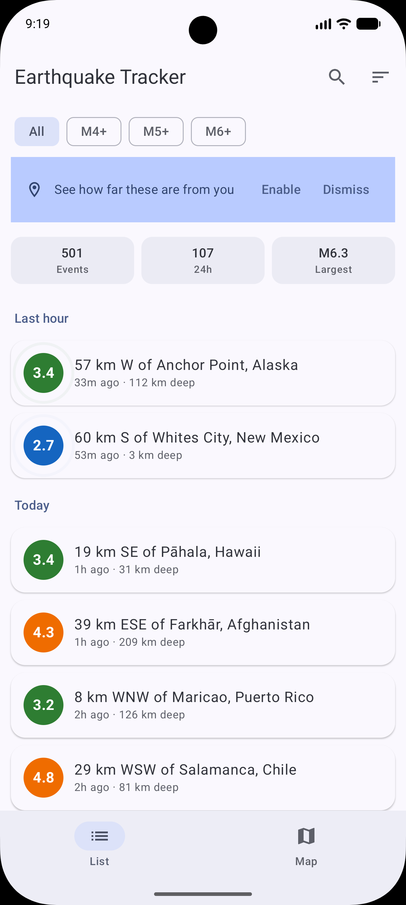
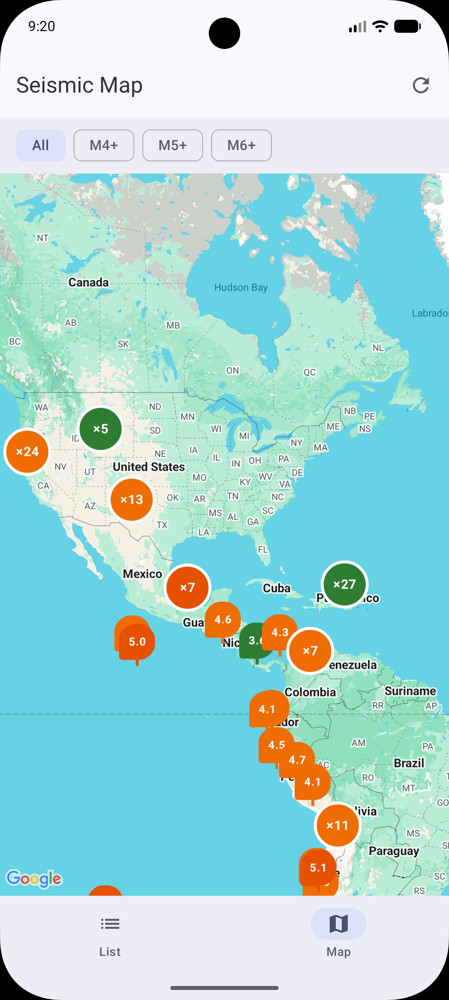
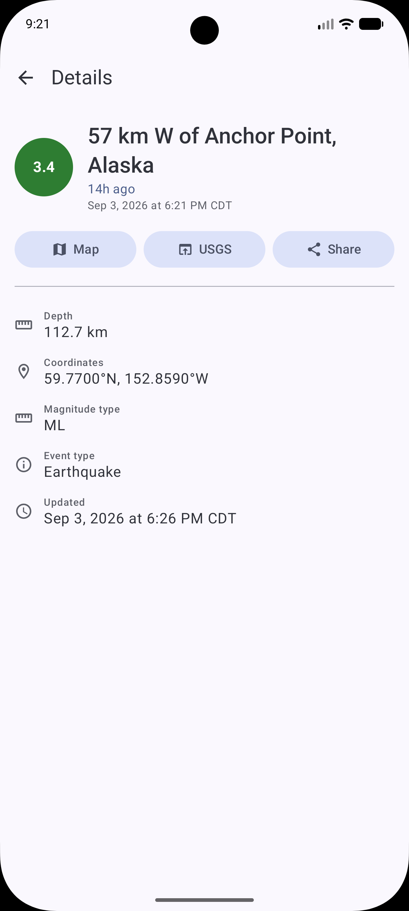
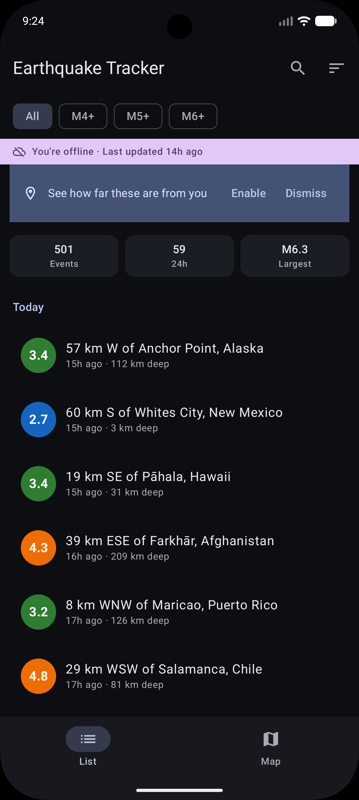
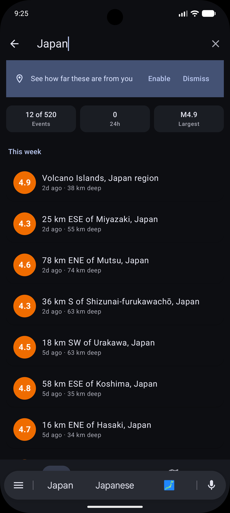
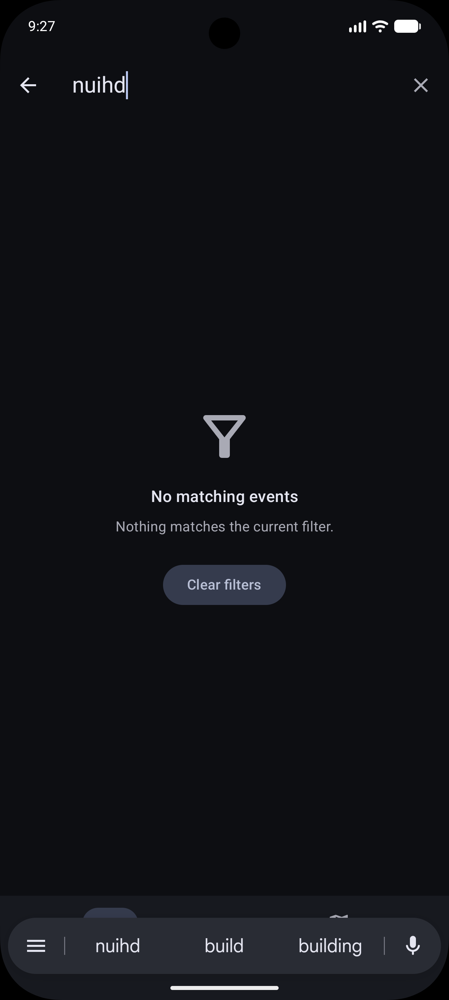

# Earthquake Tracker

A real-time earthquake monitoring app built with Kotlin and Jetpack Compose for the Brick Mobile Engineering take-home exercise. Displays seismic activity from the USGS Earthquake API on an interactive map and a searchable list, with full offline support and location-aware context.

## Screenshots

| List | Map | Detail |
|------|-----|--------|
|  |  |  |

| Dark Mode | Search | Empty State |
|-----------|--------|-------------|
|  |  |  |

## Setup & Run

### Prerequisites

- **Android Studio** Ladybug (2024.2+) or newer
- **JDK 11+**
- **Android SDK 37** (compileSdk) with min SDK 26
- A **Google Maps API key** with the Maps SDK for Android enabled

### Steps

1. Clone the repository:
   ```bash
   git clone <repo-url> && cd BrickApp
   ```

2. Add your Maps API key to `local.properties` in the project root:
   ```properties
   MAPS_API_KEY=your_google_maps_api_key_here
   ```
   The build reads this property and injects it into the Android manifest via `manifestPlaceholders`. The app will compile without it, but the map view will show a blank canvas.

3. Open the project in Android Studio, sync Gradle, and run on an emulator or device (API 26+).

4. Run unit tests:
   ```bash
   ./gradlew testDebugUnitTest
   ```

## Architecture

### MVVM + Offline-First

The app follows a **single-activity, MVVM** architecture with a unidirectional data flow:

```
USGS API ──▶ Repository ──▶ Use Cases ──▶ ViewModels ──▶ Compose UI
                 │                                          │
                 ▼                                          │
              Room DB ◀────────── single source of truth ───┘
```

**Room is the single source of truth.** The UI always reads from the database, never directly from the network. A refresh fetches from the API, maps DTOs to entities, and upserts them into Room. The UI updates because the database changed — not because the network returned. A failed refresh is **non-destructive by construction**: cached data survives any network error.

### Package Structure

```
com.brick.earthquaketracker
├── core/
│   ├── common/       AppResult<T> sealed interface, DataError types, DispatcherProvider
│   └── di/           Hilt modules (Database, Network, Location, Clock, Dispatcher)
├── data/
│   ├── local/        Room database, DAO, entity, SyncMetadataStore (DataStore)
│   ├── remote/       Retrofit UsgsApi, DTO models
│   ├── mapper/       Entity ↔ Domain mapping functions
│   ├── location/     FusedLocationProvider data source
│   └── repository/   OfflineFirstEarthquakeRepository, DefaultLocationRepository
├── domain/
│   ├── model/        Earthquake, EarthquakeListing, LocationState, SortOrder, etc.
│   ├── geo/          Haversine distance & compass bearing calculations
│   ├── repository/   Repository interfaces
│   └── usecase/      ObserveEarthquakes, ObserveEarthquakeDetail, RefreshEarthquakes
└── ui/
    ├── list/         List screen, ViewModel, ListUiState
    ├── map/          Map screen, ViewModel, MapUiState, CameraFraming, clustering
    ├── detail/       Detail screen, ViewModel, DetailUiState
    ├── filter/       FilterStateHolder (shared singleton between List & Map VMs)
    ├── components/   MagnitudeBadge, StaleDataBanner, EmptyState
    ├── navigation/   NavHost, Route sealed class, SharedTransitionProvider
    └── theme/        Material3 dynamic color theme, typography
```

### Key Libraries

| Library | Purpose |
|---------|---------|
| Jetpack Compose + Material 3 | Declarative UI with dynamic color (Material You) |
| Navigation Compose | Type-safe routes with `@Serializable` route classes |
| Hilt | Dependency injection across the app |
| Room | Local database for offline caching |
| DataStore Preferences | Sync metadata (last sync time, prompt dismissal) |
| Retrofit + kotlinx.serialization | USGS API networking with type-safe parsing |
| Google Maps Compose + Utils | Map rendering, marker clustering |
| FusedLocationProvider | User location via Play Services |
| Turbine + Truth + MockWebServer | Flow testing, assertions, API stubbing |

## Technical Decisions

### Typed Error Handling
Network errors are mapped to a sealed `DataError` hierarchy (`NoConnectivity`, `Timeout`, `Server`, `Serialization`, `Unknown`) wrapped in `AppResult<T>`. Each variant produces a specific user-facing message. Malformed API responses are rejected rather than silently defaulted.

**Alternative considered:** A simpler `Result<T, Exception>` with `when (e)` branching in the UI. Rejected because it couples the UI to exception types, and adding a new error source (e.g., a second API) would mean updating every call site. The sealed hierarchy keeps error classification in the data layer.

### Single-Flight Refresh
The repository uses a `Mutex` + `CompletableDeferred` to coalesce concurrent refresh calls. If a refresh is already in-flight, the second caller awaits the real result rather than hitting the network again. This prevents duplicate requests from pull-to-refresh and lifecycle restarts.

**Alternative considered:** A simple `if (isRefreshing) return` guard. Rejected because the second caller would get no result at all — it wouldn't know whether the refresh succeeded or failed. `CompletableDeferred` lets every caller await the real outcome of the single in-flight request.

### Location as a 5-State Machine
Location permission is modeled as a sealed interface with five states: `PermissionNotRequested`, `PermissionDenied`, `PermanentlyDenied`, `Unavailable`, `Available`. Each state drives different UI — from a non-intrusive prompt banner to a "Go to Settings" button for permanently denied permission. The app is fully functional without location; distance/bearing and "sort by nearest" are simply hidden.

**Alternative considered:** A simple `Boolean` (`hasPermission`). Rejected because Android distinguishes "never asked," "denied once," and "denied permanently" — each warrants a different UI action (ask, re-ask, or direct to Settings). Collapsing these into a boolean would lose that UX fidelity.

### Shared Filter State
`FilterStateHolder` is a Hilt `@Singleton` shared between the List and Map ViewModels. Changing the magnitude filter on one screen immediately applies it on the other, without an event bus or shared ViewModel.

**Alternative considered:** A shared `NavBackStackEntry`-scoped ViewModel, or a `SavedStateHandle`-backed approach. Rejected because the filter state has no lifecycle tie to a particular screen — it should survive navigating away and back. A Hilt singleton is the simplest construct that outlives individual screens without introducing an event bus.

## Assumptions & Tradeoffs

- **Feed endpoint**: The app fetches `summary/2.5_week.geojson` — all M2.5+ earthquakes from the past 7 days. This is a fixed endpoint; the date range is not user-configurable. Stale events (>8 days old) are pruned on each successful sync.
- **Search is client-side**: Search by location name filters the already-fetched list in Kotlin rather than making a separate API call. This is fast enough for the ~1,000 events in a typical weekly feed and keeps the app working offline.
- **Coarse location only**: The app requests `ACCESS_COARSE_LOCATION` (not fine) since city-level precision is sufficient for earthquake distance calculations and avoids a more intrusive permission dialog.
- **No pagination**: The USGS summary feed returns all events in a single response. For larger feeds (e.g., M1+ worldwide), a paginated strategy with the USGS query API would be needed.
- **Compose clustering**: Uses the `maps-compose-utils` clustering library with custom composable marker content, which handles most marker density scenarios well. Extremely dense clusters (thousands of events in a tight area) may benefit from a heatmap overlay in a future iteration.

## Scope Decisions

Several features were considered and deliberately deferred: background sync with push notifications, a user-configurable alert radius, offline safety guidance, and a settings screen. Each would have added surface area without demonstrating a materially different engineering decision — the offline-first repository, typed error handling, and location state machine already exercise those patterns. The brief values thoughtful scope over feature count, so effort went into depth (single-flight refresh, non-destructive sync, 5-state location handling, comprehensive tests) rather than breadth.

## Known Limitations & Future Work

- **Fixed data feed**: Only the M2.5+ weekly summary is supported. A future version could let users pick magnitude thresholds and date ranges via the USGS query API.
- **Heat map overlay**: The marker clustering handles density well, but a toggleable heat map layer would give a better at-a-glance view of seismic hotspots.
- **No localization**: All strings are hardcoded in English. Extracting them to `strings.xml` for i18n would be the standard next step.

## Testing

The project has **94 tests** across 10 test files, covering every layer of the architecture:

| Test File | What It Covers |
|-----------|---------------|
| `EarthquakeDaoTest` | Room queries, `syncAndPrune` transaction, magnitude filtering (Robolectric) |
| `EarthquakeMappersTest` | DTO → Entity → Domain mapping, null/malformed field handling |
| `OfflineFirstEarthquakeRepositoryTest` | Offline-first flow, error propagation, non-destructive refresh, single-flight coalescing (MockWebServer) |
| `DefaultLocationRepositoryTest` | Permission state transitions, location emission |
| `GeoMathTest` | Haversine distance, compass bearing, known city-pair calculations |
| `SortOrderTest` | Comparator correctness for each sort order |
| `ObserveEarthquakesUseCaseTest` | Distance/bearing enrichment, sort application, location-unavailable fallback |
| `EarthquakeListViewModelTest` | UI state derivation, error handling, stale-data detection, filter/sort/search updates |
| `EarthquakeListScreenTest` | Compose UI: card rendering, click callbacks, empty states, location prompt, shimmer loading (Robolectric) |
| `CameraFramingTest` | Bounding-box computation, user-location inclusion, single-point zoom |

### Testing approach

- **No mocking frameworks** — tests use fakes, in-memory Room databases, and `MockWebServer` for full control without brittle mocks.
- **Turbine** for `Flow` assertions — structured `awaitItem()` calls instead of `first()` ensure no emissions are missed.
- **Truth** for readable assertions.
- **Robolectric** for Room and Compose tests — the DAO runs against a real SQLite engine on the JVM, and Compose UI tests render real composables with `createAndroidComposeRule`, no device needed.
- **`java.time.Clock` injection** — time-dependent logic (stale-data thresholds, retention pruning) uses a testable clock, not `Instant.now()`.

### Running Tests

```bash
# All unit tests (debug variant)
./gradlew testDebugUnitTest
./gradlew testDebugUnitTest

# A single test class
./gradlew testDebugUnitTest --tests "*.EarthquakeDaoTest"
```
